# Sahayak AI - Off-grid, On-device Disaster Assistance & Relief Coordinator

> **Sahayak AI (सहायक)** is an advanced, fully localized, off-grid AI assistant designed for high-stakes emergency recovery, disaster response guidance, and localized scheme eligibility assessment during severe infrastructure outages. 
> Developed for standard mid-range mobile edge hardware, Sahayak AI operates without internet, grid electricity, or cellular carrier availability, utilizing an optimized RAG (Retrieval-Augmented Generation) pipeline, local SQLite, dense vector persistence, and efficient local LLMs (Gemma 2 / Gemma 4 edge series).

[](https://creativecommons.org/licenses/by/4.0/)
[](https://fastapi.tiangolo.com)
[](https://www.trychroma.com)
[](https://www.docker.com)
[](https://ollama.com)

---

## 📖 Table of Contents
1. [Key Features](#-key-features)
2. [Cinematic Demo Concept](#-cinematic-demo-concept)
3. [System Architecture](#-system-architecture)
4. [Project Structure](#-project-structure)
5. [Prerequisites](#-prerequisites)
6. [Quick Start (Local Dev)](#-quick-start-local-dev)
7. [Docker & Containerized Setup](#-docker--containerized-setup)
8. [Automated Verification Suite](#-automated-verification-suite)
9. [Detailed Endpoints & API Reference](#-detailed-endpoints--api-reference)
10. [Submission Track Alignment](#-submission-track-alignment)

---

## ✨ Key Features

*   **🎙️ On-Device Multi-Lingual Whisper Translation**: Converts spoken Hindi, Bengali, or English into text locally, utilizing on-device Whisper models and simulated IndicTrans models to translate and process local dialect prompts.
*   **🧠 Localized 3-Step RAG Pipeline**:
    1.  **Classify**: Automatically categorizes user queries by severity (Critical Emergency, High Alert, Moderate Help) and domain (First Aid, Evacuation, Infrastructure Repair).
    2.  **Retrieve**: Queries a local, persistent vector database containing official national guidelines (NDMA manuals, first-aid directives) chunked into HNSW graph index segments.
    3.  **Generate**: Orchestrates structured prompts for local edge models (`gemma4` / `gemma2` via Ollama/llama.cpp) to output concise, actionable survival guidelines.
*   **🗺️ Dual-Engine Map Layer**:
    *   *Online Mode*: Renders full high-resolution street maps via Leaflet.js and OpenStreetMap (OSM) server tiles.
    *   *Offline Mode*: Dynamically switches to a custom high-contrast HTML5 Canvas Vector Grid rendering localized shelter, water distribution, and medical camp GPS coordinates pulled from SQLite tables.
*   **💼 AI Government Scheme Eligibility Assessor**: Dynamically parses personal asset and crop loss descriptions against local disaster compensation criteria (crop subsidies, housing reconstruction grants) to provide structured application directives.
*   **🚨 SOS Mesh LoRa Broadcast Simulator**: Simulates high-frequency LoRa and Bluetooth Low Energy (LE) peer-to-peer packet broadcasts to nearby nodes with precise lat/long telemetry when primary cell towers are destroyed.
*   **👓 Eyes-Free Audio Interaction Mode**: Full-screen gesture tap and release capturing system with high-contrast UI designed for blind, injured, or visually impaired victims during extreme panic.

---

## 🎬 Cinematic Demo Concept
The project includes a full cinematic storyboard presentation matching the 3-minute project demonstration video script:
*   **Opening**: Floodwaters submerge communications infrastructure in Bihar. The network signal drops.
*   **Technical Showcase**: The app initializes, instantly detecting "Offline Grid" state. The victim uses Hindi voice input: *"मेरे घर में पानी घुस गया है, क्या करूँ?"*
*   **Live RAG Loop**: Whisper translates, ChromaDB retrieves official flood guidelines, and Gemma edge synthesizes instant instructions: *"High Ground shelter is 2.3km North. Elevated bypass is dry."*
*   **Closing**: The victim clicks SOS. High-contrast canvas map and LoRa mesh transmit telemetry. Relief arrives.
  
[!NOTE]> Review the cinematic storyboard reference details inside [docs/demo_script.md](file:///c:/Users/HP/MUZAN/docs/demo_script.md) and view the dynamic storyboard slides presentation in [sahayak_presentation.html](file:///c:/Users/HP/MUZAN/sahayak_presentation.html).

---

## 🏗️ System Architecture

```mermaid
graph TD
    subgraph Client Device [Smartphone Edge Simulator - Browser]
        UI[Interactive HTML5 Dashboard] --> |Voice Audio| WhisperSTT[Offline Whisper / Audio Capture]
        WhisperSTT --> |Hindi / Bengali Input| LocalTranslate[Local Transliteration / Translators]
        LocalTranslate --> |English RAG Context| LiveFetch[API Client Fetch Manager]
        UI --> |Offline State Toggle| MapEngine{Map Routing Layer}
        MapEngine --> |Online Mode| OSM[Leaflet.js & OpenStreetMap Tiles]
        MapEngine --> |Offline Mode| CanvasVector[High-Contrast HTML5 Canvas Vector Grid]
    end

    subgraph FastAPI Local Server [Python Backend - Port 8000]
        LiveFetch --> |POST /chat| MainAPI[FastAPI Router - main.py]
        LiveFetch --> |GET /poipins| MainAPI
        LiveFetch --> |POST /sync| MainAPI
        
        MainAPI --> |RAG Context Retrieval| ChromaDB[(Persistent Chroma Vector DB)]
        MainAPI --> |Classification & Context Generation| OllamaLLM[Ollama Sidecar / gemma4:8b]
        
        ChromaDB -.-> |Persists HNSW Embeddings| LocalFolder[backend/chroma_db]
        MainAPI --> |Coordinates / Schemes POI| SQLite[(Local SQLite Metadata Cache)]
    end
    
    style Client Device fill:#0f172a,stroke:#06b6d4,stroke-width:2px;
    style FastAPI Local Server fill:#1e1b4b,stroke:#a855f7,stroke-width:2px;
```



---

## 📂 Project Structure

```text
sahayak/
├── backend/
│   ├── chroma_db/             # Local SQLite and persistent Chroma DB indexes
│   ├── documents/             # Raw disaster guidelines & medical instruction manuals
│   │   ├── first_aid_guide.txt
│   │   └── flood_guidelines.txt
│   ├── Dockerfile             # Container configuration for the python server
│   ├── embed_docs.py          # Vector embedding script (ChromaDB + SentenceTransformers)
│   ├── main.py                # FastAPI core application (RAG Pipeline Endpoints)
│   └── requirements.txt       # Python server dependencies
├── docs/
│   ├── architecture.md        # Technical architectural design document
│   └── demo_script.md         # Video narration and visual script storyboard
├── docker-compose.yml         # Multi-container orchestration (FastAPI + Ollama)
├── LICENSE                    # CC-BY-4.0 Open License
├── Makefile                   # Automation command recipes (Setup, Run, Build)
├── README.md                  # This Developer Manual
├── sahayak_app.html           # Stands-alone Interactive Frontend Prototype Simulator
└── sahayak_presentation.html  # Interactive presentation and cinematic demo slides
```

---

## ⚙️ Prerequisites

To run the full-stack server and frontend, make sure you have:
*   **Operating System**: Windows (10/11), macOS, or Linux.
*   **Python**: Version `3.8` to `3.11`.
*   **Docker**: Docker Desktop (optional, for full containerized deployments).
*   **Ollama**: Installed and running locally (optional, for real LLM model inference).

---

## 🚀 Quick Start (Local Dev)

The repository provides a modular `Makefile` for automated setup, indexing, and serving.

### Step 1: Install Dependencies
Open your command terminal inside the project root directory and execute:
```bash
make install
```
This automatically sets up a local Python virtual environment (`.venv`) and installs FastAPI, ChromaDB, SentenceTransformers, and Uvicorn.

### Step 2: Ingest Reference Guides (Vector DB Build)
To compile the raw NDMA text documents, segment paragraphs, and build the persistent vector ChromaDB collection:
```bash
make embed
```
*(Runs [backend/embed_docs.py](file:///c:/Users/HP/MUZAN/embed_docs.py) internally).*

### Step 3: Run the FastAPI Server
To launch the FastAPI local web server:
```bash
make run
```
The server will boot on `http://localhost:8000`. You can access the automatic swagger API docs at `http://localhost:8000/docs`.

### Step 4: Open the Frontend Dashboard
Simply open [sahayak_app.html](file:///c:/Users/HP/MUZAN/sahayak_app.html) directly inside your web browser (Double click file or right click -> Open with Chrome/Firefox). The client simulator automatically detects the live FastAPI backend on port 8000 and activates dynamic full-stack queries!

---

## 🐳 Docker & Containerized Setup

If you prefer a zero-dependency containerized setup running both the FastAPI backend and Ollama:

```bash
# Build and spin up the multi-container stack in the background
docker-compose up -d

# Verify both containers are running
docker ps
```
The FastAPI server will be exposed on port `8000`, and Ollama will run as a sidecar service on port `11434`.

---

## 🧪 Automated Verification Suite

To confirm that the entire python stack is operational and all endpoint dependencies compile correctly:

```bash
# Execute automatic backend tests
make test
```
The test suite ensures the endpoints resolve:
*   `/` (Root state ping)
*   `/chat` (Local classification + dynamic RAG generation fallback)
*   `/poipins` (District coordinate loading)
*   `/sync` (ChromaDB background ingestion trigger)

---

## 🔌 Detailed Endpoints & API Reference

### 1. Root Handshake Status
*   **Route**: `GET /`
*   **Description**: Verifies API connectivity, vector database size, and LLM status.
*   **Response**:
    ```json
    {
      "status": "healthy",
      "vector_chunks": 42,
      "chroma_db": "connected",
      "ollama_connection": "offline_fallback_active"
    }
    ```

### 2. Multi-stage RAG chat pipeline
*   **Route**: `POST /chat`
*   **Payload**:
    ```json
    { "prompt": "My hand is bleeding heavily, how do I apply compression?" }
    ```
*   **Response**:
    ```json
    {
      "response": "Stop bleeding immediately: 1. Apply firm, direct pressure on the bleeding wound using a clean cloth or bandage. 2. Elevate the wounded limb above heart level...",
      "classification": {
        "disaster_type": "Medical Emergency",
        "severity": "URGENT",
        "lang": "en"
      },
      "retrieval_chunks": [
        "BLEEDING: Apply direct pressure using sterile dressings...",
        "FIRST AID FOR FRACTURES & BLEEDING: Clean open wounds..."
      ],
      "engine": "Local RAG Regex In-Memory Matcher (LLM Offline Fallback)"
    }
    ```

### 3. Regional Pin Coordinates Loader
*   **Route**: `GET /poipins?district=patna`
*   **Response**:
    ```json
    {
      "district": "patna",
      "pins": [
        { "name": "Patna Central Flood Shelter #1", "type": "shelter", "lat": 25.6026, "lng": 85.1199, "desc": "Beds: 120/150 available. Food: Rations active." }
      ]
    }
    ```

### 4. Background Index Sync
*   **Route**: `POST /sync`
*   **Response**:
    ```json
    {
      "status": "success",
      "msg": "Ingested 2 document manuals into local ChromaDB workspace"
    }
    ```

---

## 🏆 Submission Track Alignment

Sahayak AI is optimized for extreme compliance under modern hackathon grading parameters:

1.  **Main Hackathon Track (Disaster & Civil Recovery)**: Renders a fully functional offline app. Demonstrates concrete multi-lingual support, real-world NDMA guidelines, localized coordinate tables, and low-latency API response speeds.
2.  **Ollama Developer Prize (On-device Edge Intelligence)**: Binds edge client queries directly to Ollama sidecar models. Utilizes highly-compressed `gemma4` / `gemma2` model configurations to output strict JSON schemas.
3.  **llama.cpp Prize (Lowest Footprint & CPU Execution)**: Exposes modular fallback architectures. The backend automatically switches to highly efficient regex-indexed chunk-matching if LLM processes are cut off, guaranteeing zero downtime.

---

*Developed under open-source standards. Sahayak AI is ready for direct GitHub hosting and evaluation deployment.*
