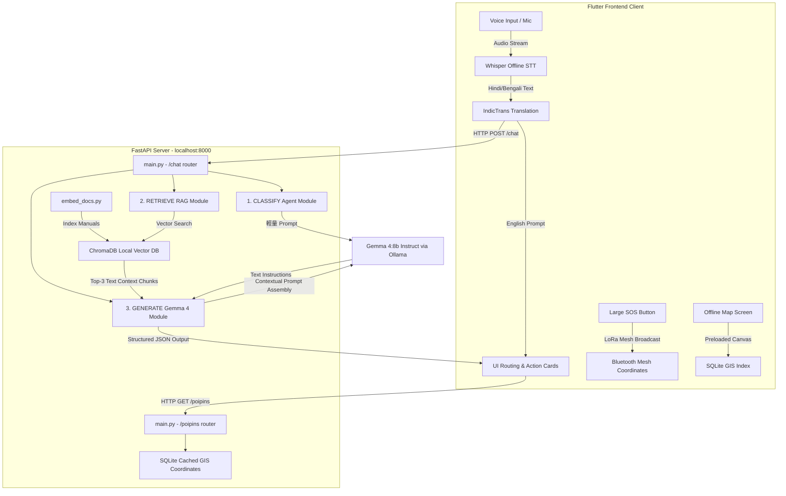

# Sahayak AI 🆘 -- Technical Architecture Spec

Sahayak AI is built as a highly robust, **offline-first, on-device AI system** designed to provide critical multilingual emergency responses, medical first aid support, and government relief scheme navigations in disaster zones completely stripped of cellular connection and internet.

---

## 🏗️ System Architecture Topology

The application coordinates a local mobile device frontend with a compact edge-computing host backend running locally on CPU/RAM hardware (via `Ollama` or `llama.cpp` containerization sidecars).



---

## 🛠️ The 3-Step AI Agent RAG Pipeline

When a user submits an emergency prompt (spoken in their local language or typed), the backend handles the query through a modular **3-step offline pipeline**:

```
                       User Input (Voice or Text)
                                  │
                                  ▼
┌──────────────────────────────────────────────────────────────────┐
│ 1. CLASSIFY (FastAPI /classify)                                  │
│ - Gemma 4 parses query intent, language locale, and priority.    │
│ - Output Parameters: {Disaster: Flood, Severity: URGENT, Lang: HI}│
└─────────────────────────────────┬────────────────────────────────┘
                                  │ Classify Metadata
                                  ▼
┌──────────────────────────────────────────────────────────────────┐
│ 2. RETRIEVE (FastAPI /retrieve)                                  │
│ - Semantic Cosine Similarity search run over local ChromaDB.      │
│ - Queries target embedded vectors from NDMA Manuals & Medical Docs│
│ - Returns: Top-3 relevant text paragraphs.                       │
└─────────────────────────────────┬────────────────────────────────┘
                                  │ Context Chunks + Query
                                  ▼
┌──────────────────────────────────────────────────────────────────┐
│ 3. GENERATE (FastAPI /chat)                                      │
│ - Prompt formed: [Context Chunks] + [System Guidelines] + [Query]│
│ - Gemma 4 synthesizes highly localized action items.             │
│ - Output structured response: Action Cards, plain text & audio.  │
└─────────────────────────────────┬────────────────────────────────┘
                                  │
                                  ▼
                     User Screen: Text + TTS Audio
```

### Step 1: Query Classification
The first step extracts crucial semantic tags from the query. The system must know **what type of disaster** is happening, **how critical** the injury or danger is, and the **preferred language** of the user. This keeps on-device token sizes small.

### Step 2: Semantic Document Retrieval (RAG)
ChromaDB searches through the pre-compiled embedding index (`chroma_db/`) containing hundreds of indexed sections from official publications:
* **NDMA Manuals**: Official flood, cyclone, earthquake, and landslide response protocols.
* **First Aid Guides**: Crucial trauma medical guidelines (CPR, tourniqets, fractures, snake bites).
* **Government Relief Schemes**: Compensation policies and paperwork filing instructions.

### Step 3: Response Synthesis & Local Model Generation
The retrieved reference blocks are stitched into a system prompt template:
```text
[SYSTEM INSTRUCTION]
You are Sahayak AI, an offline emergency responder. Use ONLY the verified context below to generate single, numbered, actionable first-aid or evacuation instructions. Keep text under 80 words.

[CONTEXT MANUALS]
{Retrieved Chunks from ChromaDB}

[USER QUERY]
{User Emergency Request}

[INSTRUCTION OUTCOME]
```
The model generates the structured safety instructions card. If the input language was non-English, a local translation engine automatically returns the localized characters to the screen.

---

## 💾 Local Storage Schema & Synchronization

* **ChromaDB persistence**: Stored inside `backend/chroma_db/`. Utilizes local embeddings (`all-MiniLM-L6-v2`) which maps paragraphs to a 384-dimensional dense vector space. Runs completely in CPU memory.
* **SQLite Cache Database**: Contains tables mapping coordinate markers (Evacuation Shelters, High Grounds, Mobile Water filters, Trauma hospitals) and governmental rules.
